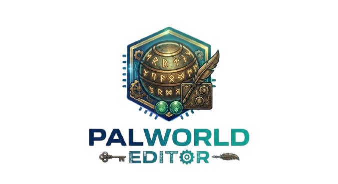

<p align="center">
  
</p>

<h1 align="center">Palworld Editor</h1>

<p align="center">
  <b>🪟 Windows only / Só Windows</b> — save editor for <b>Palworld (Xbox / Microsoft Store / Game Pass build)</b>.
  <br>
  <b>Languages / Idiomas:</b> <a href="#english">🇺🇸 English</a> · <a href="#portugues">🇧🇷 Português</a>
</p>

---

<a id="english"></a>

## 🇺🇸 English

> **Windows only.** Desktop app for Windows 10/11 that reads the Xbox/Game Pass save under
> `%LOCALAPPDATA%\Packages\PocketpairInc.Palworld_*`. It does not run on macOS or Linux.
>
> **Unofficial tool**, not affiliated with Pocketpair. Use only with a save from a game you own. See [NOTICE](NOTICE.md).

### Features
- **Items** — edit any quantity, add items you don't have, per chest / storage / inventory, with in-game names and icons.
- **Character** — level, experience and status points.
- **Pals** — level, gender, IVs (HP/Attack/Defense), soul rank and the 4 passive skills, with a "suggest best passives" helper.
- **Day / night** modern theme (Windows 11 Fluent).
- **Automatic backups** and one-click restore. An untouched copy of your original save is kept forever.
- **Finds your save by itself**, and if it can't, it asks for the game folder and searches the subfolders until it locates it.
- **Check for updates** right on the home screen: downloads and installs the new version from GitHub in one click, keeping your backups and settings.

This targets the **Xbox/GDK** build, which the common Steam editors do not read.

### Install
Open **PowerShell** and run:
```powershell
git clone https://github.com/disouz4-dev/Palworld-Edit.git
cd Palworld-Edit
powershell -ExecutionPolicy Bypass -File install.ps1
```
The installer checks for **Python** (installs it if missing), installs the dependencies, copies
the app to `%LOCALAPPDATA%\Programs\Palworld Editor`, and adds it to the **Start Menu** and the
**Desktop** with the app icon. It also registers in **Apps & Features**, so you can remove it later
from Windows Settings (or with `uninstall.ps1`). Your backups and settings live in
`%LOCALAPPDATA%\PalworldEditor` and are kept on uninstall unless you choose otherwise. Then open
**Palworld Editor** from the Start Menu (All apps).

> **Important:** run the three lines above **in order**. The `powershell ... install.ps1` line
> only works from **inside** the `Palworld-Edit` folder (the `cd` line puts you there).
>
> No git? Download the ZIP from the green **Code** button on GitHub, extract it, then run `install.ps1`.

### Usage
1. **Close Palworld** before saving (the game overwrites the save on exit).
2. Open the app, pick your world (it defaults to the **most recently played** one).
3. Edit in **Items / Character / Pals**, then click **SAVE TO GAME**.
4. If anything goes wrong in-game, use **Restore backup** on the home screen.

> **⚠️ Xbox/Game Pass cloud sync:** if your changes **don't show up** in-game, cloud sync
> restored the old save over your edit. Fix: close the game, **go offline (airplane mode)**,
> launch Palworld **offline** and load the world (it now uses the edited save), play/save a few
> seconds, exit, then **reconnect** so the edited save uploads. The editor always writes the
> local file correctly; this step just stops the cloud from undoing it.

### How it works
The Xbox save is four nested layers, all decoded from scratch in Python:
`containers.index (WGS) → container.N → CNK0 → PlZ2 (double zlib) → GVAS`. The reader/writer
round-trips the save **byte-for-byte** when nothing is edited, and writes the same way the game
itself does (a new container per save) so it never corrupts. Names and icons are read directly
from the game's IoStore (`.utoc`/`.ucas`) via the Oodle decompressor — no FModel export needed.

### License
[MIT](LICENSE). Names and artwork belong to Pocketpair — see [NOTICE](NOTICE.md).

---

<a id="portugues"></a>

## 🇧🇷 Português (PT-BR)

> **Somente Windows.** Aplicativo de desktop para Windows 10/11 que lê o save da versão
> Xbox/Game Pass em `%LOCALAPPDATA%\Packages\PocketpairInc.Palworld_*`. Não roda em macOS nem Linux.
>
> **Ferramenta não oficial**, sem vínculo com a Pocketpair. Use só com um save de um jogo que você possui. Veja o [AVISO](NOTICE.md).

### Recursos
- **Itens** — altere qualquer quantidade, adicione itens que você não tem, por baú / armazém / inventário, com os **nomes e ícones do jogo**.
- **Personagem** — nível, experiência e pontos de atributo.
- **Pals** — nível, sexo, IVs (Vida/Ataque/Defesa), rank de alma e as 4 passivas, com o botão **"sugerir melhores passivas"**.
- **Tema claro / escuro** moderno (Fluent do Windows 11).
- **Backups automáticos** e restauração com um clique. Uma cópia intocada do seu save original fica guardada para sempre.
- **Acha o seu save sozinho** e, se não achar, pergunta a pasta do jogo e **procura nas subpastas** até localizar.
- **Verificar atualização** direto na tela inicial: baixa e instala a versão nova do GitHub com um clique, mantendo seus backups e configurações.

Feito para a versão **Xbox/GDK**, que os editores comuns de Steam não conseguem ler.

### Instalar
Abra o **PowerShell** e rode:
```powershell
git clone https://github.com/disouz4-dev/Palworld-Edit.git
cd Palworld-Edit
powershell -ExecutionPolicy Bypass -File install.ps1
```
O instalador verifica o **Python** (instala se faltar), instala as dependências, copia o app para
`%LOCALAPPDATA%\Programs\Palworld Editor` e o adiciona ao **Menu Iniciar** e à **Área de Trabalho**
com o ícone. Também registra em **Adicionar/Remover programas**, então dá pra remover pelas
Configurações do Windows (ou pelo `uninstall.ps1`). Seus backups e configurações ficam em
`%LOCALAPPDATA%\PalworldEditor` e são mantidos ao desinstalar, a menos que você escolha apagar.
Depois é só abrir o **Palworld Editor** pelo Menu Iniciar (Todos os programas).

> **Importante:** rode as três linhas **na ordem**. A linha `powershell ... install.ps1` só
> funciona de **dentro** da pasta `Palworld-Edit` (a linha `cd` te leva pra lá). Se rodar de
> `C:\Windows\system32` dá erro de "arquivo não existe".
>
> Sem git? Baixe o ZIP no botão verde **Code** do GitHub, extraia e rode o `install.ps1`.

### Como usar
1. **Feche o Palworld** antes de salvar (o jogo reescreve o save ao sair).
2. Abra o app e escolha o seu mundo (o app já abre o **jogado mais recentemente**).
3. Edite em **Itens / Personagem / Pals** e clique em **SALVAR NO JOGO**.
4. Se algo der errado no jogo, use **Restaurar backup** na tela inicial.

> **⚠️ Nuvem do Xbox/Game Pass:** se ao abrir o jogo as mudanças **não aparecerem**, a
> sincronização na nuvem restaurou o save antigo por cima. Solução: feche o jogo,
> **desconecte a internet (modo avião)**, abra o Palworld **offline** e carregue o mundo
> (agora ele usa o save editado), jogue/salve alguns segundos, saia e **reconecte** — assim
> o save editado sobe para a nuvem. O editor sempre grava certo no arquivo local; esse passo
> só impede a nuvem de desfazer.

### Como funciona
O save do Xbox tem quatro camadas, todas decodificadas na mão em Python:
`containers.index (WGS) → container.N → CNK0 → PlZ2 (zlib duplo) → GVAS`. O leitor/escritor
devolve o save **byte a byte idêntico** quando nada é editado, e grava do mesmo jeito que o
próprio jogo (novo container a cada save) para não corromper. Nomes e ícones são lidos direto
do IoStore do jogo (`.utoc`/`.ucas`) usando o Oodle — sem precisar exportar no FModel.

### Licença
[MIT](LICENSE). Nomes e arte pertencem à Pocketpair — veja o [AVISO](NOTICE.md).
